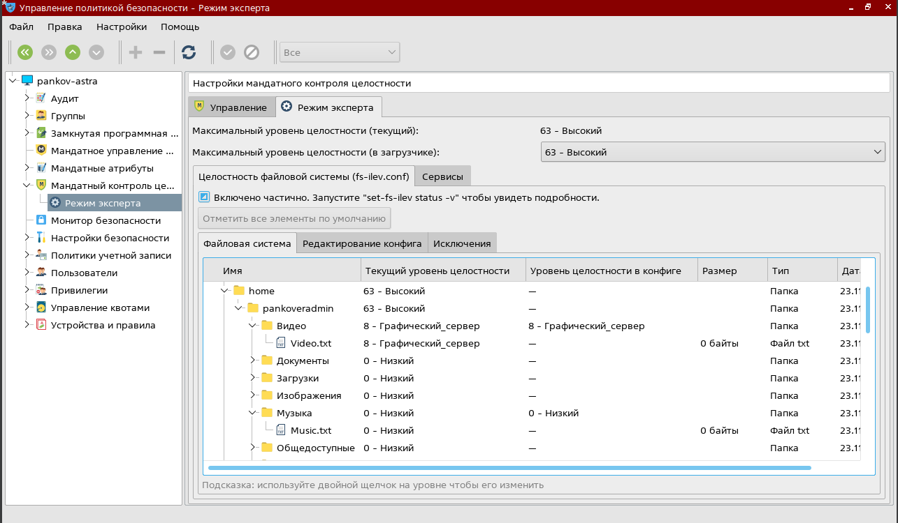

# TOIB-PR-5 
# Практическое задание на тему "Контроль целостности"
Выполнил студент группы: ББМО-02-23 Панков Евгений Ромуальдович
## Установка и запуск виртуальной машины с Astra linux
Для выполнения данного задания был скачан образ Astra Linux ( ссылка: https://1drv.ms/u/s!Ap1Ijs338IQ9gZFmLJ5hn45FgcVLoQ?e=mH7Jzg ) и установлена версия системы "Смоленск" с максимальным уровнем защиты

### Установка, настройка и проверка мандатного контроля целостности
##Для установки МКЦ в ОС Astra Linux выбираем указанные галочки в процессе установки ISO образа 

## Для измнения конфигурации МКЦ в Astra Linux необходимо запустить утилиту "Управление политикой безопасности"

## В меню "Режим эксперта" назначаем уровни целостности для директорий. В качестве проверки правила NWU обозначили 2 тестовые директории ("Музыка" и "Видео") с  правами:

## Проверяем настройку мандатного контроля зайдя в учетную запись с атрибутом целостности на уровне "Низкий".

## Пример взаимодействия (записи) между тестовыми директориями:

Здесь можно увидеть, что копирование файла с атрибутом ниже в папку с атрибутом выше не сработало - была получена ошибка доступа. В то же время "запись вниз" работает.
### Работа с режимом замкнутой программной среды
## Проверка работы режима ЗПС в утилите "Управлении политикой безопасности" посредством включения настроек:

## В качестве тестового файла был взят скрипт инициализации AnyDesk. Результат выполнения:

### Работа с утилитами контроля целостности и регламентного контроля целостности
## Использование `gostsum`
Утилита `gostsum` вычисляет хэш-сумму файлов в соответствии с ГОСТ Р 34.11-2012. Пример использования с .deb пакетом:  
 
## Использование `afick`
`afick` - утилита, предназначенная для контроля целостности файловой системы ОС. Для корректной работы утилиты сначала создается БД утилиты:  
 
## Далее изменим часть системных файлов для получения ответа от утилиты, перед этим сделав бэкап:  
 
## Получаем результат от утилиты:  
 
